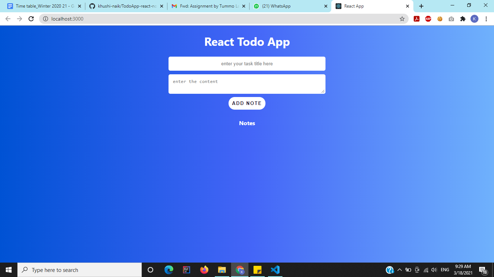
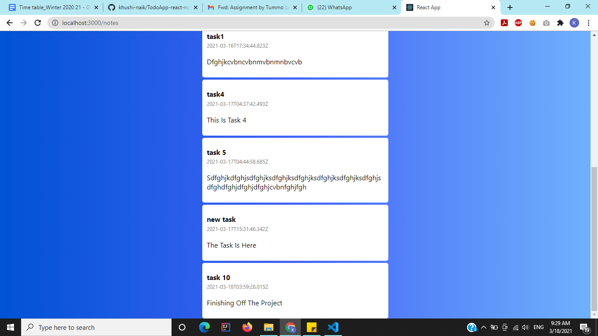

# TodoApp-react-node-mongo

This todo-app enables the user to add new tasks and preview previous ones. The application has been developed using Reactjs, Nodejs and MongoDb for its database.

The entire code can be found on - [Google-Drive Link](https://drive.google.com/file/d/1zFwzaEDShU4QNVriPGKboqoCsv5d7pJ0/view?usp=sharing)
 The frontend (testreact) repo can be found on - [testreact repo](https://github.com/khushi-naik/test3-app.git)

### The technologies used in the application are-
1. Reactjs has been used for the frontend of the application.
2. Nodejs gives the backend and uses express and mongoose.
3. MongoDB stores the database of the application.

After cloning the repo, run the following commands in a terminal for backend:
```
npm install
npm start
```
Open another terminal and run the following commands for frontend:
```
cd testreact
npm install
npm start
```
Following are the screenshots of the todo application-





